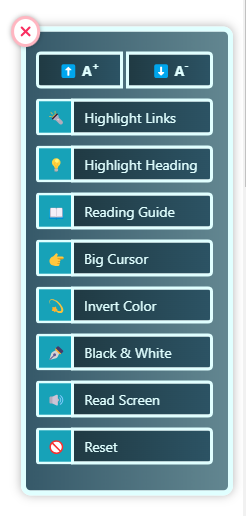

# Accessibility Menu Widget

The Accessibility Menu Widget is designed to enhance the user experience by providing a range of accessibility features for web pages.

## Features

The widget includes the following features:

- **Font Increase/Decrease:** Allows users to adjust the font size for better readability.
- **Big Cursor:** Increases the cursor size for improved visibility.
- **Screen Reader:** Provides a voiceover for the content-text on the page.
- **Invert Color:** Inverts the colors on the screen for better contrast.
- **Highlight Links:** Emphasizes links for easier identification.
- **Highlight Heading:** Highlights headings for better navigation.
- **Reading Guide:** Adds a reading guide to assist in following text.
- **Black & White:** Converts the page to black and white for reduced visual complexity.
- **Reset:** Resets all changes made by the widget to default settings.
- **Close:** Closes the accessibility menu widget.

## Usage

To integrate the Accessibility Menu Widget into your web page:

1. Include the necessary script and CSS files.
2. Create a trigger (button, link, etc.) to open the menu.
3. Implement the necessary JavaScript functions to handle each feature's functionality.

## Installation

You can install the widget by including the provided JavaScript and CSS files in your project.

## How to Use

#### CSS Initialization
```html
<link rel="stylesheet" href="assets/css/style.css">
```

#### JavaScript Initialization
```javascript
<script src="assets/js/script.js"></script>
```

#### HTML Initialization

Include the following HTML code in your web page to create the accessibility menu button.

```html
<button class="accessibility-menu-btn" id="settings-toggle">
     🤖
</button>
```
For the menu to work properly, the button must have the class `accessibility-menu-btn` and the id `settings-toggle`.
Now, include `.content` class to the content of your web page like below:

```html
<div class="content">
    <div>
        <h1>This is a heading</h1>
        <p>
            Lorem ipsum dolor sit amet consectetur adipisicing elit.
            Quisquam, voluptatum. Quisquam, voluptatum. Quisquam, voluptatum.
        </p>
    </div>
</div>
```
This is how your widget should look like:




### Note:
Have some dependencies with bootstrap and jquery. So, make sure you have included them in your project.
* Bootstrap CSS CDN:
```html
<link rel="stylesheet" href="https://cdn.jsdelivr.net/npm/bootstrap@4.0.0/dist/css/bootstrap.min.css" integrity="sha384-Gn5384xqQ1aoWXA+058RXPxPg6fy4IWvTNh0E263XmFcJlSAwiGgFAW/dAiS6JXm" crossorigin="anonymous">
```
* Bootstrap & jQuery CDN:
```html
<script src="https://code.jquery.com/jquery-3.2.1.slim.min.js" integrity="sha384-KJ3o2DKtIkvYIK3UENzmM7KCkRr/rE9/Qpg6aAZGJwFDMVNA/GpGFF93hXpG5KkN" crossorigin="anonymous"></script>
<script src="https://cdn.jsdelivr.net/npm/popper.js@1.12.9/dist/umd/popper.min.js" integrity="sha384-ApNbgh9B+Y1QKtv3Rn7W3mgPxhU9K/ScQsAP7hUibX39j7fakFPskvXusvfa0b4Q" crossorigin="anonymous"></script>
<script src="https://cdn.jsdelivr.net/npm/bootstrap@4.0.0/dist/js/bootstrap.min.js" integrity="sha384-JZR6Spejh4U02d8jOt6vLEHfe/JQGiRRSQQxSfFWpi1MquVdAyjUar5+76PVCmYl" crossorigin="anonymous"></script>
```


----------------------------------------------------

Contributing
------------
Raisul Islam Hridoy -
Software Engineer, Riseup Labs