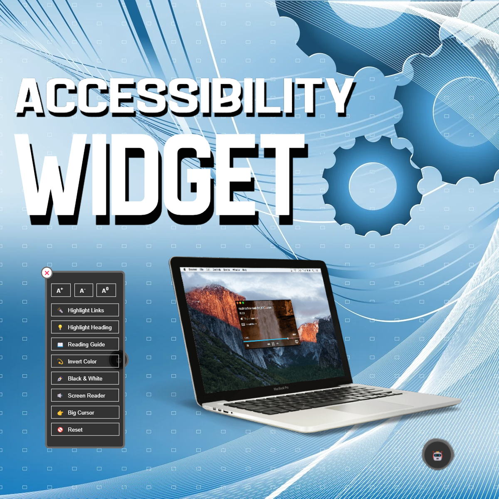

# Accessibility Menu Widget

The Accessibility Menu Widget is designed to enhance the user experience by providing a range of accessibility features for web pages.

<p align="center">
    
</p>

## Features

The widget includes the following features:

- **Font Increase/Decrease:** Allows users to adjust the font size for better readability.
- **Big Cursor:** Increases the cursor size for improved visibility.
- **Screen Reader:** Provides a voiceover for the content-text on the page.
- **Invert Color:** Inverts the colors on the screen for better contrast.
- **Highlight Links:** Emphasizes links for easier identification.
- **Highlight Heading:** Highlights headings for better navigation.
- **Reading Guide:** Adds a reading guide to assist in following text.
- **Black & White:** Converts the page to black and white for reduced visual complexity.
- **Reset:** Resets all changes made by the widget to default settings.
- **Close:** Closes the accessibility menu widget.

## Usage

To integrate the Accessibility Menu Widget into your web page:

1. Include the necessary script and CSS.
2. Create a trigger (button, link, etc.) to open the menu. (Optional)
3. Implement the necessary JavaScript functions to handle each feature's functionality.

## Installation

You can install the widget by including the provided JavaScript and CSS files in your project.


#### CSS Initialization
```html
<link type="text/css" rel="stylesheet" href="https://cdn.jsdelivr.net/gh/hridoyraisul/accessibility-menu-widget@main/assets/css/widget.min.css">
```

#### JavaScript Initialization
```html
Initialize jQuery
<script src="https://code.jquery.com/jquery-3.2.1.slim.min.js" integrity="sha384-KJ3o2DKtIkvYIK3UENzmM7KCkRr/rE9/Qpg6aAZGJwFDMVNA/GpGFF93hXpG5KkN" crossorigin="anonymous"></script>

Initialize the widget
<script src="https://cdn.jsdelivr.net/gh/hridoyraisul/accessibility-menu-widget@main/assets/js/widget.min.js"></script>
```

#### HTML Initialization
Include HTML code `<div id="widgetInit"></div>` in your web page body root like below:
```html
<body>
    <div id="widgetInit"></div>
</body>
```

Include `.widget-applicable-content` class to the content of your web page like below, so that the widget can apply the changes to the content of your web page inside this `.widget-applicable-content` class. It will basically wrap the content of your web page where the widget will be applicable.

```html
<body>
    <div id="widgetInit"></div>
    
    <div class="widget-applicable-content">
        <div>
            <h1>This is a heading</h1>
            <p>
                Lorem ipsum dolor sit amet consectetur adipisicing elit.
                Quisquam, voluptatum. Quisquam, voluptatum. Quisquam, voluptatum.
            </p>
        </div>
        ...
        ...
    </div>
</body>
```

## How to Use
Let's see how to use the accessibility menu widget.

### Initialize the widget
Initialize the widget by calling the `accessibilityMenuWidget()` function on the `#widgetInit` element. This will create the widget on your web page.
```javascript
$(document).ready(function () {
    $('#widgetInit').accessibilityMenuWidget();
});
```
### Customize widget button
You can customize the widget button by passing the `showWidgetVisibleButton` and `widgetVisibleButtonPosition` parameters to the `accessibilityMenuWidget()` function.
```javascript
$(document).ready(function () {
    $('#widgetInit').accessibilityMenuWidget({
        showWidgetVisibleButton: true,
        widgetVisibleButtonPosition: 'right',
    });
});
```
Here, `showWidgetVisibleButton` parameter is used to show/hide the widget button. By default, it is set to `true`. If you want to hide the widget button, you can set it to `false`.

Also `widgetVisibleButtonPosition` parameter is used to set the position of the widget button. By default, it is set to `right`. If you want to set the position of the widget button to left, you can set it to `left`.
Like below:
```javascript
$(document).ready(function () {
    $('#widgetInit').accessibilityMenuWidget({
        showWidgetVisibleButton: true,
        widgetVisibleButtonPosition: 'left',
    });
});
```
If you don't want to show the widget button, and want to access the widget by clicking your own custom button or link, then you can simply apply like below:
```javascript
$(document).ready(function () {
    $('#widgetInit').accessibilityMenuWidget({
        showWidgetVisibleButton: false,
    });
});
```
And then you can access the widget by clicking your own custom button or link like below:
```html
<button id="your_custom_button" onclick="visibleWidget()">Accessibility Menu</button>
```
Here, `visibleWidget()` is the function that will open the widget. So, you need to define the `visibleWidget()` function like above example.

### Customize widget features
You can customize the widget features by passing the `features` parameter to the `accessibilityMenuWidget()` function. Which will show the features you want to show in the widget.
You can pass the features like below:
```javascript
$(document).ready(function () {
    $('#widgetInit').accessibilityMenuWidget({
        features: ['highlight-links','highlight-heading','reading-guide','invert-color','black-white','screen-reader','big-cursor'],
    });
});
```
In the above example,
- `highlight-links` will show the highlight links feature in the widget.
- `highlight-heading` will show the highlight heading feature in the widget.
- `reading-guide` will show the reading guide feature in the widget.
- `invert-color` will show the invert color feature in the widget.
- `black-white` will show the black & white feature in the widget.
- `screen-reader` will show the screen reader feature in the widget.
- `big-cursor` will show the big cursor feature in the widget.

You can show/hide the font increase/decrease feature by passing the `showFontSizeButtons` parameters to the `accessibilityMenuWidget()` function. Here `showFontSizeButtons` accepts boolean value. By default, it is set to `false`. If you don't want to show the font increase/decrease feature, you can set it to `false`. By default, it is set to `true`. So, if you want to show the font increase/decrease feature, you don't need to pass the `showFontSizeButtons` parameter to the `accessibilityMenuWidget()` function.
```javascript
$(document).ready(function () {
    $('#widgetInit').accessibilityMenuWidget({
        showFontSizeButtons: false,
    });
});
```
Also show/hide the reset feature by passing the `showResetButton` parameters to the `accessibilityMenuWidget()` function.
```javascript
$(document).ready(function () {
    $('#widgetInit').accessibilityMenuWidget({
        showResetButton: true,
    });
});
```

### Customize widget position
You can customize the widget position by passing the `widgetPosition` & `closeButtonPosition` parameters to the `accessibilityMenuWidget()` function. Here `widgetPosition` & `closeButtonPosition` accepts string value. 
By default, `widgetPosition` is set to `right` & `closeButtonPosition` is set to `left`. If you want to set the position of the widget to left, you can set like below:
```javascript
$(document).ready(function () {
    $('#widgetInit').accessibilityMenuWidget({
        widgetPosition: 'left',
        closeButtonPosition: 'right',
    });
});
```

----------------------------------------------------

### Contributing

<b>Raisul Islam Hridoy</b> <br>
Software Engineer, Riseup Labs <br>
Social Links: <br>
[LinkedIn](https://www.linkedin.com/in/raisulhridoy/) | [Facebook](https://www.facebook.com/exheartz) | [Twitter](https://twitter.com/raisulhridoy) | [GitHub](http://github.com/hridoyraisul) | [Instagram](https://www.instagram.com/raisulhridoy/) | [WhatsApp](https://wa.me/8801686851584)